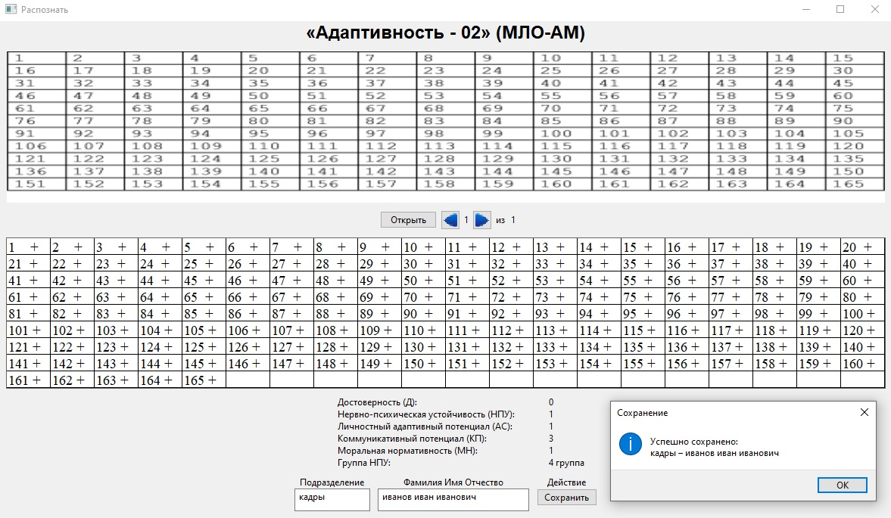

# adapt-maklakov
Recognition application for the psychological test.

## Usage
- Select neccessary image(s) with the button "Открыть"
- Use arrows to navigate between images
- Use keyboard or mouse to switch between '-' and '+'
- Fill fields at the bottom, then save data with the button "Сохранить"

## Features
- Picture recognition
- Digital translation
- Answer editor
- Simple database to save data

## Example
